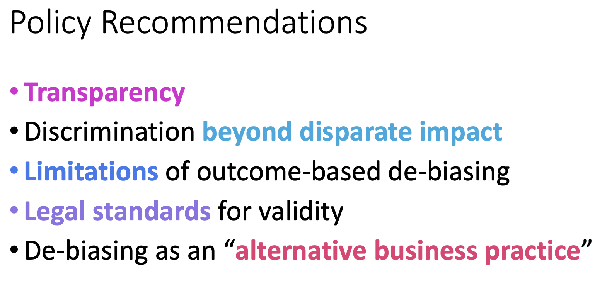

# Auditing/Assessment 2: Mitigating Bias in Algorithmic Hiring: Evaluating Claims and Practices

| Item | Description |
| --- | --- | 
| Presented By | Megan Price |
| Paper | [Mitigating Bias in Algorithmic Hiring: Evaluating Claims and Practices](https://dl.acm.org/doi/pdf/10.1145/3351095.3372828?download=true) |

## Notes

- *Overbooking*: Charging an individual with charges higher/above the actual crime
- There are a series of risk assessment tools currently used to determine holding/bail conditions:
    - Statistical models that generate a risk matrix to inform whether to release, detain or apply conditions
    - Catch all conditions that automatically default to detain. Eg:
        - Murder
        - Aggrevated mayhem
        - etc
- Possibility exists to game the system to ensure the police obtain certain outcomes, eg
    - Mention specific items in charge sheets to ensure individuals are detained

