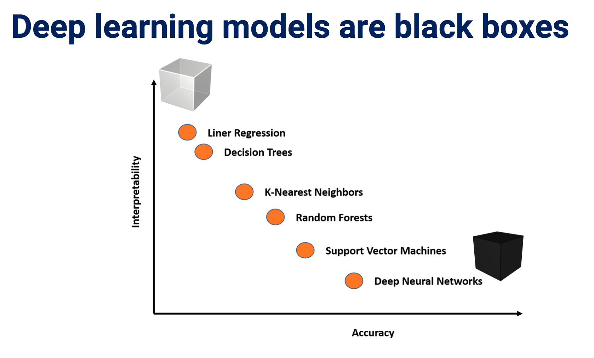

# Cognition & Education: Artificial mental phenomena: Psychophysics as a framework to detect perception biases in AI models

| Item | Description |
| --- | --- | 
| Presented By | Daniel E. Acuna |
| Reference | [Artificial mental phenomena: Psychophysics as a framework to detect perception biases in AI models](https://dl.acm.org/doi/pdf/10.1145/3351095.3375623?download=true) |

## Notes

- Contend that bias in black box systems can be identified & uncovered based on psychometric analysis rooted in identifying biases in psychological studies
- Results tend to demonstrate that bias can be identified using this approach

**Worth reading the paper**