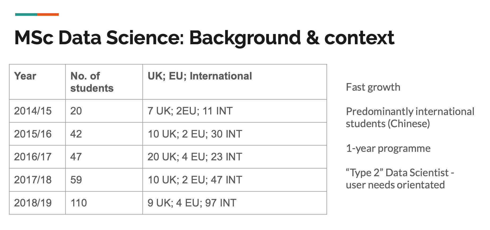
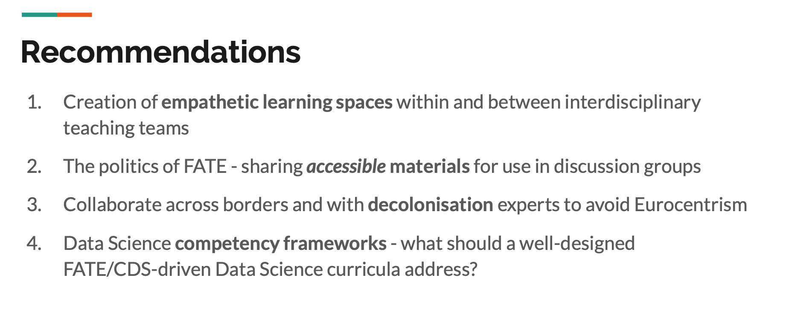

# Cognition & Education: Integrating FATE/Critical Data Studies into Data Science curricula: where are we going and how do we get there?

| Item | Description |
| --- | --- | 
| Presented By | Jo Bates |
| Reference | [Integrating FATE/Critical Data Studies into Data Science Curricula: Where are we going and how do we get there?](https://dl.acm.org/doi/pdf/10.1145/3351095.3372832?download=true) |

## Notes

- "Type 2" data scientist
    - More focused on user needs rather than programming heavy

- CDS: critical data studies
- Struggled to achieve deeper integration across both the students (international vs local) & integration across the broader course

- Recommendations:
    - Create more empathetic learning spaces
    - Make it easy to share materials
    - Collaborate across borders & cultures to ensure it's more global leaning/thinking

