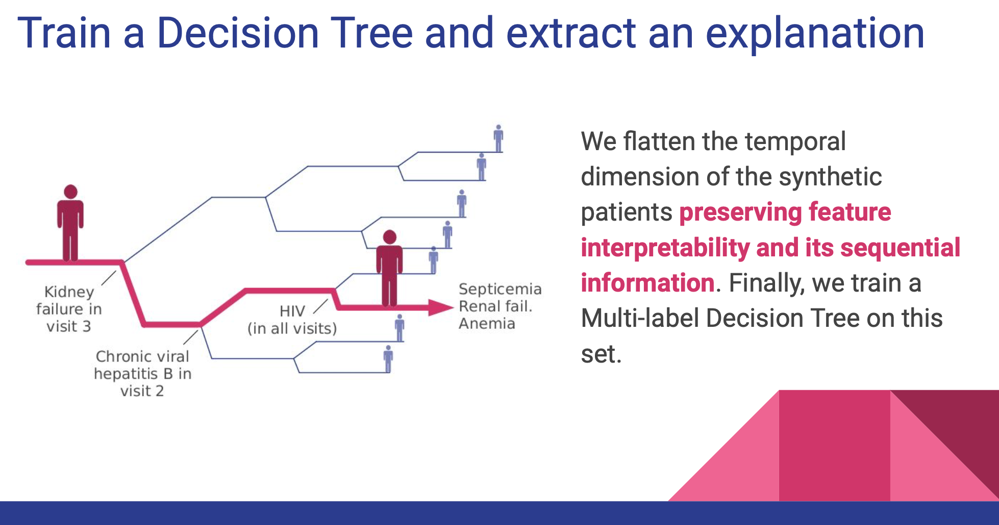

# Explainability: Doctor XAI: An ontology-based approach to black-box sequential data classification explanations

| Item | Description |
| --- | --- | 
| Presented By | Cecilia Panigutti |
| Paper | [Doctor XAI: An ontology-based approach to black-box sequential data classification explanations](https://dl.acm.org/doi/pdf/10.1145/3351095.3372855?download=true) |

## Notes

- An agnostic explainer that can deal with sequential inputs & can leverage ontologies
- Leverages an ontology based similarity metric
- Synthetic patients are generated based on the ontology & use that to train a decision tree to be used as the explainer. The intention is the tree preserves the feature importance

