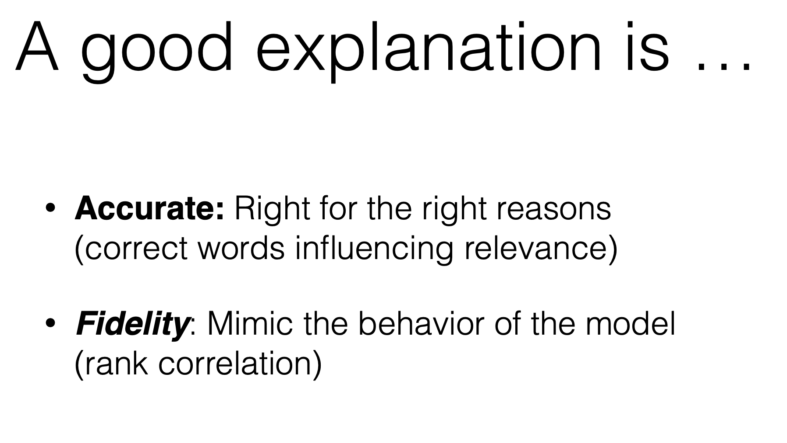

# Explainability: Model Agnostic Interpretability of Text Rankers via Intent Modelling

| Item | Description |
| --- | --- | 
| Presented By | Jaspreet Singh |
| Paper | [Model Agnostic Interpretability of Rankers via Intent Modelling](https://dl.acm.org/doi/pdf/10.1145/3351095.3375234?download=true) |

## Notes

- Search intent: context surrounding the intent behind a search. Without it search is considerably harder
- Goal is to perform local interpretability for rankings

- Can overly scoring metrics on the results to obtain histograms similar to SHAP force plots
- Approach is focused on NLP problems

