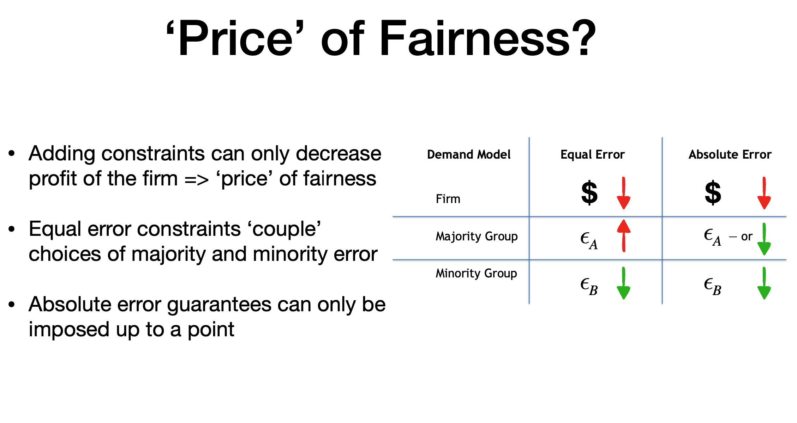

# Fairness 4: The Effects of Competition and Regulation on Error Inequality in Data-Driven Markets

| Item | Description |
| --- | --- | 
| Presented By | Hadi Elzayan |
| Reference | [The E!ects of Competition and Regulation on Error Inequality in Data-Driven Markets](https://dl.acm.org/doi/pdf/10.1145/3351095.3372842?download=true) |

## Notes

- Generated a theoretical model to allow for testing & simulation of competition & business goals (fairness vs profit, etc)
- Showed that competition doesn't improve economic fairness except for the most extreme case, when everyone behaves like homo-economicus

