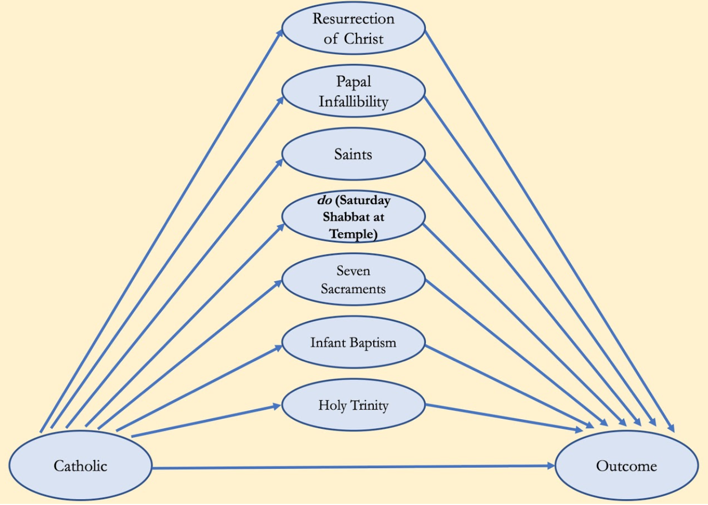

# Sensitive Attributes: What’s Sex Got to Do With Fair Machine Learning?

| Item | Description |
| --- | --- | 
| Presented By | Issa Kohler-Hausmann |
| Reference | [What’s Sex Got To Do With Machine Learning?](https://dl.acm.org/doi/pdf/10.1145/3351095.3375674?download=true) |

## Notes

- What makes algorithmic tools biased?
    - Some contend this is a causal question requiring a causal solution
- Pearl contends social kinds can be represented as causal elements

For example:
- Causal Nodes:
    - Department
    - Gender
    - Feed into: Admission

- Assume independence, the relationships are causal & pathways are modular
- *Modularity*: can change any one node & the other independent nodes won't change
- Papers contends that modularity isn't implicit & doesn't hold
- Eg:
    

**`contact authors for actual paper`**